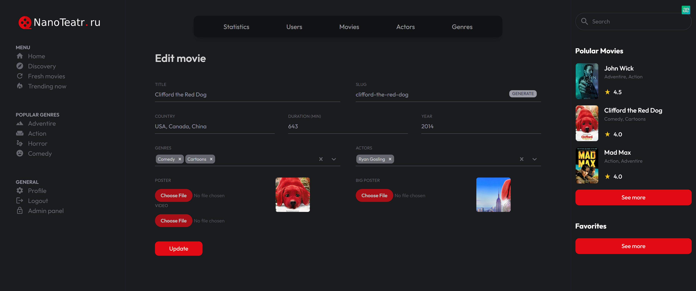
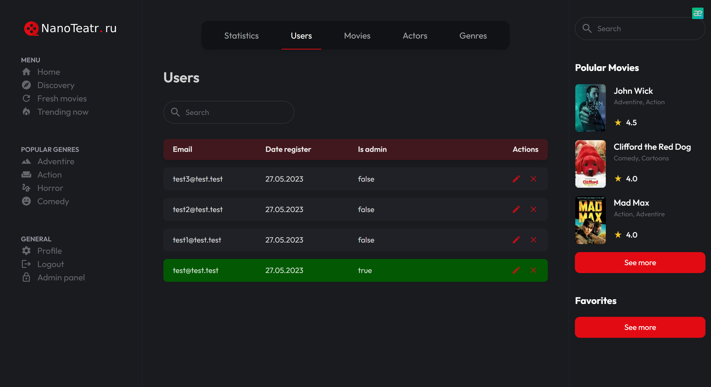
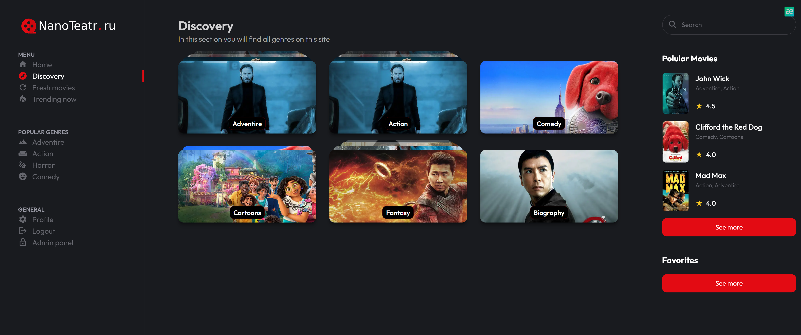

## Онлайн кинотеатр

TypeScript

Моя работа: Fullstack с 0.

>Ссылка на гитхаб:

>Клиент: https://github.com/pirogHub/onlineCinema-client

>Сервер: https://github.com/pirogHub/onlineCinema-server

Краткое описание:
- Реализован сервис по отдельному созданию категорий фильмов, жанров
- Реализован сервис по созданию карточек фильмов, добавления к ним постеров и описания
- Видеоплеер для просмотра
- Админ панель со списком пользователей, фильмов, + вывод самого популярного видео
- Выставление рейтинга фильмам
- Доступ к страницам регулируется ролью юзера (админ или обычный пользователь)
- Создание моделей MongoDB и связей между ними
-• Глубокий запрос сущностей из БД (через agregations)

### Стек, технологии и проч:
>Сервер:
NestJS, accessToken, Доступ по ролям через кастомные Guards

>Клиент:
Видеоплеер, Доступ к роутам по ролям,Админка, Редактирование фильмов Администратором, NextJS, Redux, Frammer motion, useQuery

>Database: MongoDB

